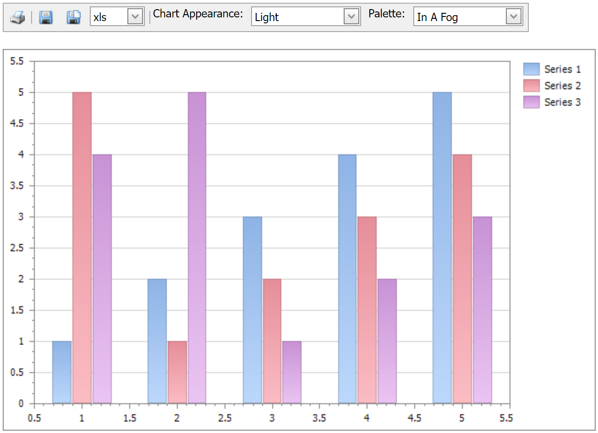

<!-- default badges list -->

<!-- default badges end -->

# Web Forms Chart - How to Implement the Web Toolbar

The following example demonstrates how to create a toolbar similar to the one available in the <a href="http://demos.devexpress.com/XtraChartsDemos/">XtraCharts Web Demo</a>. This toolbar allows you to print a WebChartControl, export it to various formats (PDF, XLS, PNG, JPEG, BMP, TIFF, GIF), as well as change its palette and appearance.

 

NOTE: To be able to use this toolbar in your application, you need to have a license for the ASPxEditors assembly.

## Files to Review

* [Default.aspx](./CS/WebSite/Default.aspx) (VB: [Default.aspx](./VB/WebSite/Default.aspx))
* [Default.aspx.cs](./CS/WebSite/Default.aspx.cs) (VB: [Default.aspx.vb](./VB/WebSite/Default.aspx.vb))

## Documentation

* [Data Editors - Product Information](https://docs.devexpress.com/AspNet/7898/components/data-editors/product-information)
<!-- feedback -->
## Does this example address your development requirements/objectives?

 

(you will be redirected to DevExpress.com to submit your response)
<!-- feedback end -->
